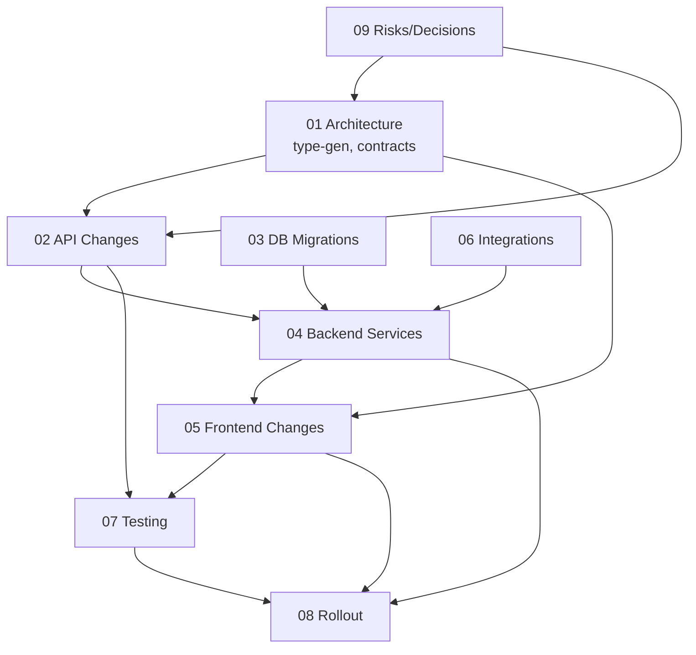

# Revamp ↔ API Alignment — Project Plan

> Decomposition of the work described in [docs/architecture/REVAMP_API_ALIGNMENT.md](../../architecture/REVAMP_API_ALIGNMENT.md) into executable engineering workstreams.
>
> **Status:** Planning
> **Owner:** TBD
> **Target window:** TBD
> **Last updated:** 2026-06-07

---

## 1. Goal

Bring the `binectics-api@main` surface into alignment with `binectics-frontend@revamp` so every screen in the new design system is backed by real, typed, production-grade data — with no demo constants, no localStorage-only state, and no enum drift between repos.

## 2. Workstreams (folder index)

| # | Workstream | Lead repo(s) | Primary deliverable |
|---|---|---|---|
| [01](./01-Architecture-and-Alignment/README.md) | Architecture & Alignment | both | Type generation pipeline, contract-first conventions, error/pagination standard |
| [02](./02-API-Changes/README.md) | API Changes | api | New endpoints, modified responses, aligned enums |
| [03](./03-Database-and-Migrations/README.md) | Database & Migrations | api | Schema additions + backfills (User flags, conversations, notification category) |
| [04](./04-Backend-Services/README.md) | Backend Services | api | Messaging, search, geo, aggregate, notification grouping, auth flags |
| [05](./05-Frontend-Changes/README.md) | Frontend Changes | frontend | Wire mocks → real APIs, generate types, remove duplicated region map |
| [06](./06-Integrations/README.md) | Integrations | api / infra | IP-geo provider, realtime transport, observability hooks |
| [07](./07-Testing-and-QA/README.md) | Testing & QA | both | Contract tests, E2E, perf budgets, visual regression |
| [08](./08-Deployment-and-Rollout/README.md) | Deployment & Rollout | both / infra | Feature flags, backward-compat, staged rollout, cache strategy |
| [09](./09-Risks-and-Open-Questions/README.md) | Risks & Open Questions | product / eng leads | Scope decisions and unresolved questions blocking design |

## 3. Cross-workstream dependency graph

**Critical path:** `09 (scope decisions)` → `01 (codegen + enum SoT)` → `03 (DB)` → `04 (services)` → `05 (wire frontend)` → `07 (contract + E2E)` → `08 (rollout)`.

## 4. Parallelisation strategy

Three streams can run independently once §09 decisions are made:

| Stream | Workstreams | Notes |
|---|---|---|
| **Stream A — Foundations** | 01, 03 (User flags + Notification.category), parts of 02 | Unblocks everything else; must finish first |
| **Stream B — Search + Aggregates** | Search (04), Geo (04+06), Aggregate endpoints (04) | Net-new modules, no entanglement with existing flows |
| **Stream C — Wiring + Enum sweep** | 05 (notifications drawer, member home week grid, region map cleanup), enum alignment in 02 | Can start as soon as Stream A's API surface is merged |

Testing (07) and rollout (08) overlay all three streams continuously.

## 5. Effort summary

| Workstream | T-shirt | Confidence |
|---|---|---|
| 01 Architecture | M | High |
| 02 API Changes | L | Medium |
| 03 DB & Migrations | M | High |
| 04 Backend Services | L | Medium |
| 05 Frontend Changes | L | High |
| 06 Integrations | M | Medium |
| 07 Testing & QA | M | Medium |
| 08 Deployment | S | High |
| 09 Risks | S (decision work) | — |

## 6. Out of scope (for this project)

- Wearable integrations / vitals (other than the decision to drop the HR scatter)
- White-label / partner API
- Advanced analytics dashboards beyond provider summary
- Bulk SMS/WhatsApp campaigns
- New marketing/landing copy (design already shipped)

## 7. How to use these folders

Each workstream folder has a `README.md` containing: Overview, Scope, Detailed task breakdown, Dependencies, Risks, Acceptance criteria. Sub-files within folders break down individual epics where needed. Treat tickets as a starting point — refine when assigning to engineers.

Ticket-ready backlog: [EXECUTION_BACKLOG](./EXECUTION_BACKLOG.md)

## 8. Execution checklist (decision-locked run sheet)

This checklist reflects resolved decisions in [09-Risks-and-Open-Questions](./09-Risks-and-Open-Questions/README.md):

- Messaging deferred this phase; keep UI entry with Coming Soon state.
- Search in scope for listings, bookings, clients, plans.
- No realtime in v1.
- Search implementation is Mongo `$text` (English-first).
- Geo resolution is MaxMind with fallback chain `Accept-Language` then `US/USD/en-US`.
- Contract alignment is OpenAPI-generated frontend types.
- Aggregates include member home, provider dashboards, notifications grouped feed, marketplace detail, bookings dashboard, admin overview.

### Step 1: Foundations (must complete first)

- [ ] `01` Add API schema export script and CI guard for schema drift.
- [ ] `01` Add frontend schema sync script and generated types output path.
- [ ] `01` Approve enum source-of-truth policy (generated from API schema).
- [ ] `03` Add User fields (`is_onboarding_complete`, `must_change_password`, name split fields).
- [ ] `03` Add Notification `category` field and backfill script.
- [ ] `03` Add Mongo indexes for search and aggregate read paths.

### Step 2: API contract implementation

- [ ] `02` Ship `/search` contract with scopes: listings/bookings/clients/plans.
- [ ] `02` Ship aggregate endpoint contracts: member home, provider dashboard, grouped notifications, marketplace detail, bookings dashboard, admin overview.
- [ ] `02` Ship `/geo/resolve` contract with source metadata.
- [ ] `02` Ship additive response updates for auth/check-ins/notifications/utility/listings.
- [ ] `02` Mark messaging endpoints as phase 2 backlog (not in v1 scope).

### Step 3: Backend services

- [ ] `04` Implement Search module with Mongo `$text` query + ranking.
- [ ] `04` Implement Geo module with MaxMind lookup and fallback chain.
- [ ] `04` Implement aggregate services and cache invalidation hooks.
- [ ] `04` Implement auth user-flag behavior (`must_change_password`, onboarding completion).
- [ ] `04` Implement notifications category grouping + unread by category.

### Step 4: Frontend wiring

- [ ] `05` Replace notification demo constants with API-backed drawer.
- [ ] `05` Replace member home hardcoded week grid with aggregate data.
- [ ] `05` Wire provider dashboards to aggregate endpoints.
- [ ] `05` Wire CommandBar search to `/search` (scopes locked).
- [ ] `05` Replace messaging screens with explicit Coming Soon route/state.
- [ ] `05` Replace onboarding localStorage gates with API user flag.
- [ ] `05` Move region pricing resolution to `/geo/resolve` + utility config.

### Step 5: Integration readiness

- [ ] `06` Install and verify MaxMind DB refresh process.
- [ ] `06` Confirm Redis/cache availability for aggregate endpoints.
- [ ] `06` Add observability metrics and alerts for search/aggregate/geo endpoints.

### Step 6: Verification gates

- [ ] `07` Contract tests for all modified and new v1 endpoints.
- [ ] `07` E2E for onboarding, member home, provider dashboards, search, notification drawer.
- [ ] `07` Performance validation against endpoint p95 targets.
- [ ] `07` Visual regression pass for revamp surfaces with real API data.

### Step 7: Rollout

- [ ] `08` Deploy DB changes and backfills before enabling dependent flags.
- [ ] `08` Deploy API with flags off.
- [ ] `08` Deploy frontend with domain flags and Coming Soon messaging behavior.
- [ ] `08` Enable internal cohort, then beta, then GA after monitoring gates pass.

### Exit criteria for phase completion

- [ ] No demo/hardcoded data remains in shipped revamp surfaces.
- [ ] All selected D1-D7 decisions are reflected in production behavior.
- [ ] Messaging is visibly deferred (Coming Soon) without broken routes.
- [ ] Search and aggregates operate within agreed p95 budgets.
- [ ] Rollback runbook validated in staging.
