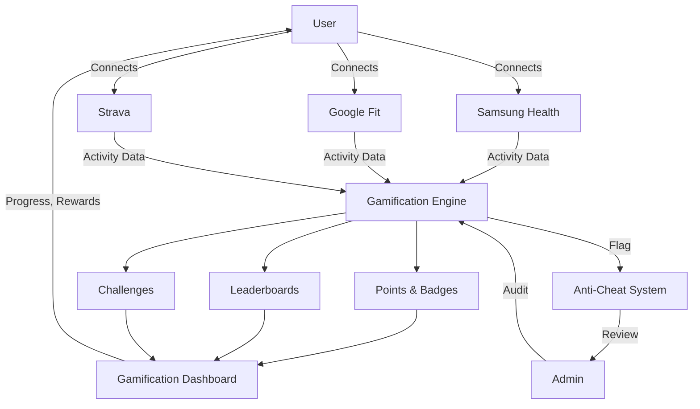
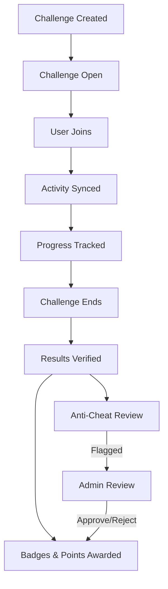
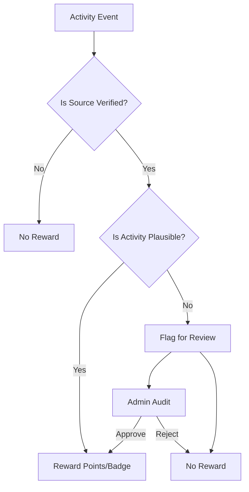

---
# Meal Plan Feature – Updated Specification

## Overview
Dietitians can create meal plans independently, without selecting a client first. Meal plans are managed in the dietitian's library and can be shared/assigned to one or more clients at any time after creation.

## Key Changes
- **No profileId required for creation:**
  - The meal plan creation flow no longer requires a client (profileId) to be selected upfront.
  - Dietitians can create, edit, and manage meal plans in their own workspace.
- **Sharing/Assignment:**
  - After a meal plan is created, the dietitian can share or assign it to any number of clients.
  - Assignment can be done from the meal plan list or detail view, with a UI to select one or more clients.
- **planId usage:**
  - planId is only required for editing or viewing an existing meal plan.

## Updated User Flow
1. Dietitian clicks "Create Meal Plan" (no client selection needed).
2. Fills out meal plan details and saves.
3. After creation, can assign/share the plan with any client(s) via a dedicated UI.
4. Clients receive the assigned meal plan in their dashboard.

## UI/UX Implications
- Remove any required profileId checks from the meal plan creation page.
- Add an "Assign to Client(s)" action in the meal plan detail or list view.
- Show which clients have each plan assigned in the meal plan list.

## Data Model Implications
- MealPlan: { id, title, description, meals[], createdBy, assignedTo[] }
  - assignedTo[] is an array of client user IDs.

## Error Handling
- If a dietitian tries to assign a plan to a client who already has it, show a friendly message.
- If no clients are selected during assignment, prompt to select at least one.

## Migration/Transition
- Existing plans with profileId can be migrated to the new model by moving profileId to assignedTo[].

---
# Gamification System – Technical Specification

## 1. Feature Overview

The Binectics Gamification System is a premium, multi-role, anti-cheat rewards engine designed to drive engagement, retention, and verified achievement across the fitness ecosystem. It is architected to:

- **Motivate and reward all user types:**
  - Fitness enthusiasts earn points, badges, and leaderboard ranks for verified activity (workouts, check-ins, challenge participation).
  - Trainers and dietitians can create and manage challenges, track client progress, and earn professional recognition badges.
  - Gym owners can sponsor challenges, view gym-specific leaderboards, and reward top-performing members.
- **Integrate with trusted health data sources:**
  - Users can connect Samsung Health, Google Fit, and Strava accounts via OAuth (frontend-only, secure public flows).
  - Only verified activity (QR check-ins, API-sourced workouts/steps) is eligible for rewards, ensuring fairness and anti-cheat integrity.
- **Support both free and premium tiers:**
  - Free users access basic points, badges, and public leaderboards.
  - Premium/verified users unlock advanced challenges, exclusive badges, and professional recognition.
- **Enforce anti-cheat and verification:**
  - All rewards require verified activity; suspicious events are flagged for admin review.
  - Admins have audit tools to review, approve, or revoke rewards based on anti-cheat signals.

### System Data Flow Diagram

**Legend:**
- Users connect external providers (Samsung Health, Google Fit, Strava) to sync activity data.
- The Gamification Engine processes verified data, awards points/badges, updates leaderboards, and manages challenges.
- The Anti-Cheat System flags suspicious activity for admin review and audit.

## 2. Goals & Motivation
- Increase user engagement and retention.
- Encourage healthy competition and social sharing.
- Reward verified activity and platform participation.
- Differentiate Binectics with a trusted, anti-cheat gamification layer.

## 3. User Roles & Access
- **Fitness Enthusiast:** Earns points, badges, and ranks via workouts, check-ins, and challenges.
- **Trainer/Dietitian:** Can create challenges, view client progress, and earn professional badges.
- **Gym Owner:** Can sponsor challenges, view gym leaderboard, and reward top members.
- **Admin:** Manages badge definitions, reviews flagged activity, and audits anti-cheat logs.

## 4. Core Mechanics

- **Points:**
  - Awarded for verified workouts, gym check-ins, challenge completions, and maintaining streaks.
  - Points scale with activity intensity, duration, and challenge difficulty.
  - Bonus points for streaks, first-time achievements, and premium challenge wins.

- **Badges:**
  - Earned for reaching specific milestones or completing special actions.
  - **Criteria Examples:**
    - "100 Gym Check-ins" (verified by QR)
    - "10,000 Steps in a Day" (from Samsung/Google/Strava)
    - "Challenge Champion" (top 3 in a verified challenge)
    - "Consistency Streak" (7+ days of activity)
    - "Early Adopter" (first 100 users to connect a provider)
  - Badges are tiered: bronze, silver, gold, platinum, and some are exclusive to premium/verified users.
  - All badge awards require verified data and pass anti-cheat checks.

- **Leaderboards:**
  - Rankings by points, badges, or challenge performance.
  - Scopes: global, country, gym, challenge, and friends.
  - Filterable by role (enthusiast, trainer, gym, dietitian) and time period (daily, weekly, all-time).

- **Challenges:**
  - Time-bound competitions (e.g., most steps in a week, gym attendance streaks, calories burned).
  - Users join, sync activity, and track progress in real time.
  - At challenge end, results are verified and rewards distributed.
  - Only verified activity counts; suspicious results are flagged for review.

- **Streaks:**
  - Daily/weekly activity streaks tracked and rewarded.
  - Streaks reset if no verified activity is detected for a day/week.

- **Verification:**
  - Only data from trusted sources (QR check-in, connected health APIs) is eligible for points/badges.
  - Manual input or unverified data is ignored for rewards.

### Challenge Lifecycle Diagram

## 5. Integration (External APIs)
- **Samsung Health, Google Fit, Strava:**
  - OAuth-based connection flow (frontend-only, no secret keys).
  - Read-only access to activity data (steps, workouts, calories).
  - Data mapped to platform events (e.g., steps → points, workouts → badges).
  - User can disconnect at any time.

## 6. Data Model (Frontend Types)
- `GamificationProfile`: { userId, points, badges[], streak, rank, connectedProviders[] }
- `Badge`: { id, name, description, icon, criteria, isVerified }
- `Challenge`: { id, name, type, startDate, endDate, participants[], leaderboard[] }
- `LeaderboardEntry`: { userId, points, rank, avatarUrl }
- `ProviderConnection`: { provider, status, lastSync }

## 7. UI/UX Patterns
- Gamification dashboard (points, badges, streaks, leaderboards)
- Challenge cards with join/progress/claim actions
- Badge gallery (earned, locked, premium)
- Provider connection UI (Samsung/Google/Strava connect/disconnect)
- Anti-cheat status indicators (verified/unverified)

## 8. Security, Anti-Cheat & Verification

- **Verified Activity Only:**
  - All points, badges, and leaderboard entries require data from trusted sources (QR, Samsung Health, Google Fit, Strava).
  - Manual or suspicious input is ignored for rewards.

- **Anti-Cheat Logic:**
  - Every activity event is checked for source and plausibility.
  - Examples of flagged events:
    - Step counts exceeding human limits (e.g., 100K steps/day)
    - Multiple gym check-ins in rapid succession
    - Challenge results inconsistent with synced data
  - Flagged events are sent to admin audit tools for review.

- **Admin Audit Tools:**
  - Admins can view flagged events, review user history, and approve or reject rewards.
  - All audit actions are logged for transparency.

- **Token Security:**
  - No sensitive tokens are stored in the frontend; OAuth tokens are short-lived and securely managed.

## 9. API/Client Interactions
- All gamification logic is frontend-only; data is fetched from the external API and mapped client-side
- No backend code or database in this repo (see Claude.MD absolute rule)
- Use enums for all badge types, challenge types, and provider names
- All API calls use `NEXT_PUBLIC_API_URL` and OAuth public flows

## 10. Testing & Rollout Plan
- Unit tests for all gamification logic (points, badge awarding, streaks)
- Mocked API responses for Samsung/Google/Strava
- Manual QA for anti-cheat and verification flows
- Feature flag for staged rollout (NEXT_PUBLIC_ENABLE_GAMIFICATION)

---
**Last updated:** 2026-03-28
