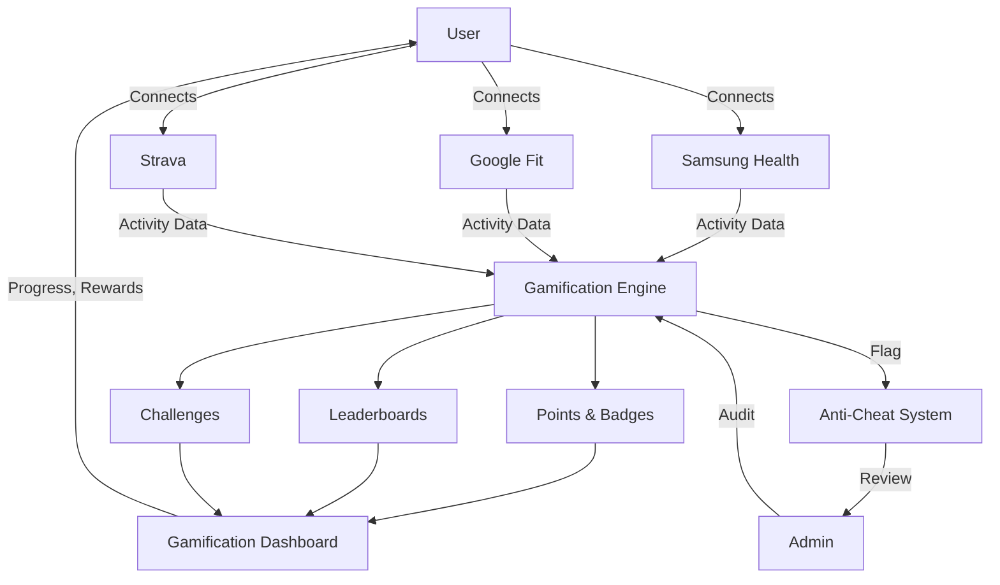
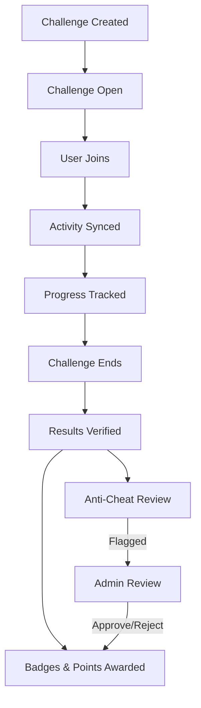
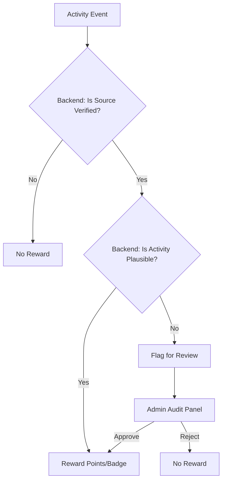

---
# Meal Plan Feature – Updated Specification

## Overview
Dietitians can create meal plans independently, without selecting a client first. Meal plans are managed in the dietitian's library and can be shared/assigned to one or more clients at any time after creation.

## Key Changes
- **No profileId required for creation:**
  - The meal plan creation flow no longer requires a client (profileId) to be selected upfront.
  - Dietitians can create, edit, and manage meal plans in their own workspace.
- **Sharing/Assignment:**
  - After a meal plan is created, the dietitian can share or assign it to any number of clients.
  - Assignment can be done from the meal plan list or detail view, with a UI to select one or more clients.
- **planId usage:**
  - planId is only required for editing or viewing an existing meal plan.

## Updated User Flow
1. Dietitian clicks "Create Meal Plan" (no client selection needed).
2. Fills out meal plan details and saves.
3. After creation, can assign/share the plan with any client(s) via a dedicated UI.
4. Clients receive the assigned meal plan in their dashboard.

## UI/UX Implications
- Remove any required profileId checks from the meal plan creation page.
- Add an "Assign to Client(s)" action in the meal plan detail or list view.
- Show which clients have each plan assigned in the meal plan list.

## Data Model Implications
- MealPlan: { id, title, description, meals[], createdBy, assignedTo[] }
  - assignedTo[] is an array of client user IDs.

## Error Handling
- If a dietitian tries to assign a plan to a client who already has it, show a friendly message.
- If no clients are selected during assignment, prompt to select at least one.

## Migration/Transition
- Existing plans with profileId can be migrated to the new model by moving profileId to assignedTo[].

---

# Gamification System – Technical Specification

## 1. Feature Overview

The Binectics Gamification System is a premium, multi-role, anti-cheat rewards engine designed to drive engagement, retention, and verified achievement across the fitness ecosystem. All gamification logic (points calculation, badge awards, anti-cheat validation, leaderboard ranking, challenge lifecycle, and provider token management) is **backend-driven**. The frontend is a display and interaction layer that consumes the gamification API.

- **Motivate and reward all user types:**
  - Fitness enthusiasts earn points, badges, and leaderboard ranks for verified activity (workouts, check-ins, challenge participation).
  - Trainers and dietitians can create and manage challenges, track client progress, and earn professional recognition badges.
  - Gym owners can sponsor challenges, view gym-specific leaderboards, and reward top-performing members.
- **Integrate with trusted health data sources:**
  - Users can connect Samsung Health, Google Fit, and Strava accounts via an OAuth flow initiated from the frontend and completed by the backend (token exchange, encrypted storage, and refresh are all server-side).
  - Only verified activity (QR check-ins, API-sourced workouts/steps) is eligible for rewards, ensuring fairness and anti-cheat integrity.
- **Support both free and premium tiers:**
  - Free users access basic points, badges, and public leaderboards.
  - Premium/verified users unlock advanced challenges, exclusive badges, and professional recognition.
- **Enforce anti-cheat and verification:**
  - All rewards require verified activity; suspicious events are flagged for admin review.
  - Anti-cheat validation runs server-side on every activity event before points are awarded.
  - Admins have audit tools to review, approve, or revoke rewards based on anti-cheat signals.

> **Architecture note:** See `binectics-api/docs/gamification/TECH_SPEC_GAMIFICATION.md` for the backend domain model, endpoints, points engine, and anti-cheat service design.

### System Data Flow Diagram



**Legend:**

- Users connect external providers (Samsung Health, Google Fit, Strava) to sync activity data.
- The Gamification Engine processes verified data, awards points/badges, updates leaderboards, and manages challenges.
- The Anti-Cheat System flags suspicious activity for admin review and audit.

## 2. Goals & Motivation

- Increase user engagement and retention.
- Encourage healthy competition and social sharing.
- Reward verified activity and platform participation.
- Differentiate Binectics with a trusted, anti-cheat gamification layer.

## 3. User Roles & Access

- **Fitness Enthusiast:** Earns points, badges, and ranks via workouts, check-ins, and challenges.
- **Trainer/Dietitian:** Can create challenges, view client progress, and earn professional badges.
- **Gym Owner:** Can sponsor challenges, view gym leaderboard, and reward top members.
- **Admin:** Manages badge definitions, reviews flagged activity, and audits anti-cheat logs.

## 4. Core Mechanics

- **Points:**
  - Awarded for verified workouts, gym check-ins, challenge completions, and maintaining streaks.
  - Points scale with activity intensity, duration, and challenge difficulty.
  - Bonus points for streaks, first-time achievements, and premium challenge wins.

- **Badges:**
  - Earned for reaching specific milestones or completing special actions.
  - **Criteria Examples:**
    - "100 Gym Check-ins" (verified by QR)
    - "10,000 Steps in a Day" (from Samsung/Google/Strava)
    - "Challenge Champion" (top 3 in a verified challenge)
    - "Consistency Streak" (7+ days of activity)
    - "Early Adopter" (first 100 users to connect a provider)
  - Badges are tiered: bronze, silver, gold, platinum, and some are exclusive to premium/verified users.
  - All badge awards require verified data and pass anti-cheat checks.

- **Leaderboards:**
  - Rankings by points, badges, or challenge performance.
  - Scopes: global, country, gym, challenge, and friends.
  - Filterable by role (enthusiast, trainer, gym, dietitian) and time period (daily, weekly, all-time).

- **Challenges:**
  - Time-bound competitions (e.g., most steps in a week, gym attendance streaks, calories burned).
  - Users join, sync activity, and track progress in real time.
  - At challenge end, results are verified and rewards distributed.
  - Only verified activity counts; suspicious results are flagged for review.

- **Streaks:**
  - Daily/weekly activity streaks tracked and rewarded.
  - Streaks reset if no verified activity is detected for a day/week.

- **Verification:**
  - Only data from trusted sources (QR check-in, connected health APIs) is eligible for points/badges.
  - Manual input or unverified data is ignored for rewards.

### Challenge Lifecycle Diagram



## 5. Integration (External APIs)

- **Samsung Health, Google Fit, Strava:**
  - **OAuth flow:** Frontend calls `POST /gamification/providers/:provider/connect` to get a redirect URL, then redirects the user. The backend handles the OAuth callback (`GET /gamification/providers/:provider/callback`), exchanges the authorization code for tokens, encrypts them, and stores them server-side. No OAuth tokens are ever stored or handled in the frontend.
  - **Sync:** Backend periodically syncs activity data from connected providers (every 6 hours). Users can trigger a manual sync via `POST /gamification/providers/:provider/sync`. Synced data is validated by the anti-cheat service before awarding points.
  - **Disconnect:** Frontend calls `DELETE /gamification/providers/:provider` to revoke access and remove the connection.
  - **Frontend displays:** Connection status, last sync time, and provider name — fetched from `GET /gamification/providers`.

## 6. Data Model (Frontend Types)

Frontend types map to backend API response shapes. The backend owns all gamification state; the frontend only displays it.

```ts
// Matches GET /gamification/profile
interface GamificationProfile {
  user_id: string;
  total_points: number;
  weekly_points: number;
  monthly_points: number;
  level: number;
  current_streak_days: number;
  longest_streak_days: number;
  last_activity_at: string | null;
  badge_count: number;
  challenges_completed: number;
  rank: {
    global: number;
    country: number | null;
  };
}

// Matches GET /gamification/badges (definition) and GET /gamification/badges/my (earned)
interface BadgeDefinition {
  _id: string;
  name: string;
  description: string;
  icon_url: string;
  tier: BadgeTier;
  trigger_event: GamificationEventType;
  threshold: number;
  is_active: boolean;
}

interface UserBadge {
  _id: string;
  badge_definition_id: BadgeDefinition;
  awarded_at: string;
  trigger_event_id?: string;
}

// Matches GET /gamification/challenges/:id
interface Challenge {
  _id: string;
  title: string;
  description: string;
  challenge_type: ChallengeType;
  status: ChallengeStatus;
  target_value: number;
  start_date: string;
  end_date: string;
  participant_count: number;
  reward_points: number;
  reward_badge: BadgeDefinition | null;
  my_progress: {
    progress_value: number;
    is_completed: boolean;
    rank: number;
  } | null;
  leaderboard: LeaderboardEntry[];
}

// Matches GET /gamification/leaderboard entries
interface LeaderboardEntry {
  rank: number;
  user_id: {
    _id: string;
    first_name: string;
    last_name: string;
    profile_picture?: string;
    country?: string;
  };
  value: number;
  trend: 'up' | 'down' | 'same';
}

// Matches GET /gamification/providers
interface ProviderConnection {
  provider: ActivityProvider;
  status: ProviderConnectionStatus;
  last_sync_at: string | null;
  provider_user_id: string | null;
}

// Matches GET /gamification/activity
interface ActivityEvent {
  _id: string;
  event_type: GamificationEventType;
  source: ActivitySource;
  provider?: ActivityProvider;
  points_awarded: number;
  metadata: Record<string, unknown>;
  is_verified: boolean;
  activity_date: string;
}
```

> **Enums** (`BadgeTier`, `ChallengeType`, `ChallengeStatus`, `GamificationEventType`, `ActivityProvider`, `ActivitySource`, `ProviderConnectionStatus`, `LeaderboardScope`, `LeaderboardPeriod`) are shared between frontend and backend. Frontend copies live in `src/lib/enums/` or `src/utils/enums.ts`.

## 7. UI/UX Patterns

- Gamification dashboard (points, badges, streaks, leaderboards)
- Challenge cards with join/progress/claim actions
- Badge gallery (earned, locked, premium)
- Provider connection UI (Samsung/Google/Strava connect/disconnect)
- Anti-cheat status indicators (verified/unverified)

## 8. Security, Anti-Cheat & Verification

All security-critical logic runs on the backend. The frontend displays verification status and anti-cheat indicators but does not perform validation.

- **Verified Activity Only:**
  - All points, badges, and leaderboard entries require data from trusted sources (QR, Samsung Health, Google Fit, Strava).
  - The backend `AntiCheatService` validates every activity event before awarding points.
  - The frontend displays `is_verified` status on activity events and badges.

- **Anti-Cheat (Backend-Driven):**
  - Every activity event is checked server-side for source and plausibility before points are awarded.
  - Flagged events are stored with `is_verified: false` and zero points until admin review.
  - Examples of server-side flags:
    - Steps > 50,000/day
    - Check-ins > 3/day
    - Calories > 5,000/day
    - Workout duration > 300 min/day
  - Frontend shows flagged status on activity events but cannot approve/reject (admin-only).



- **Admin Audit Tools (Admin Dashboard):**
  - Admin frontend fetches flagged events from `GET /gamification/admin/flags`.
  - Approve: `PATCH /gamification/admin/flags/:id/approve` — backend retroactively awards points.
  - Reject: `PATCH /gamification/admin/flags/:id/reject` — no points awarded.
  - All audit actions are logged server-side.

- **Token Security:**
  - OAuth tokens are **never stored or handled in the frontend**. The backend encrypts tokens at rest (AES-256) and manages refresh cycles.
  - The frontend only stores the user's JWT for API authentication.
  - OAuth flow: frontend redirects to provider → provider redirects to backend callback → backend stores tokens → frontend receives connection status.

## 9. API/Client Interactions

The frontend is a **display and interaction layer**. All gamification logic (points calculation, badge awards, anti-cheat validation, leaderboard ranking, challenge lifecycle, provider token management) is **backend-driven**. No backend code exists in this repo — the frontend calls the external API.

### API Service Layer

All API calls go through `NEXT_PUBLIC_API_URL`. Create a dedicated gamification API service:

```ts
// src/services/gamification.service.ts
const BASE = `${process.env.NEXT_PUBLIC_API_URL}/gamification`;

export const gamificationApi = {
  // Profile
  getProfile: () => fetchWithAuth(`${BASE}/profile`),

  // Badges
  getBadgeDefinitions: () => fetchWithAuth(`${BASE}/badges`),
  getMyBadges: () => fetchWithAuth(`${BASE}/badges/my`),

  // Challenges
  getChallenges: (params?) => fetchWithAuth(`${BASE}/challenges`, { params }),
  getChallenge: (id: string) => fetchWithAuth(`${BASE}/challenges/${id}`),
  getMyChallenges: () => fetchWithAuth(`${BASE}/challenges/my`),
  joinChallenge: (id: string) => fetchWithAuth(`${BASE}/challenges/${id}/join`, { method: 'POST' }),

  // Leaderboard
  getLeaderboard: (params: LeaderboardQuery) => fetchWithAuth(`${BASE}/leaderboard`, { params }),

  // Providers
  getProviders: () => fetchWithAuth(`${BASE}/providers`),
  connectProvider: (provider: string) => fetchWithAuth(`${BASE}/providers/${provider}/connect`, { method: 'POST' }),
  disconnectProvider: (provider: string) => fetchWithAuth(`${BASE}/providers/${provider}`, { method: 'DELETE' }),
  syncProvider: (provider: string) => fetchWithAuth(`${BASE}/providers/${provider}/sync`, { method: 'POST' }),

  // Activity
  getActivity: (params?) => fetchWithAuth(`${BASE}/activity`, { params }),

  // Admin
  getFlags: (params?) => fetchWithAuth(`${BASE}/admin/flags`, { params }),
  approveFlag: (id: string) => fetchWithAuth(`${BASE}/admin/flags/${id}/approve`, { method: 'PATCH' }),
  rejectFlag: (id: string, notes: string) => fetchWithAuth(`${BASE}/admin/flags/${id}/reject`, { method: 'PATCH', body: { admin_notes: notes } }),
};
```

### Frontend Responsibilities

- **Display** gamification profile, badges, leaderboards, challenges, activity history, and provider connections.
- **Initiate** actions: join challenges, connect/disconnect providers, trigger syncs.
- **Use enums** for all badge tiers, challenge types/statuses, event types, provider names, leaderboard scopes.
- **No client-side computation** of points, badge eligibility, streak resets, or leaderboard ranking — all state comes from API responses.
- **Optimistic UI** only for user-initiated actions (join challenge, connect provider) with rollback on API error.

### What the Frontend Does NOT Do

- ❌ Calculate points or determine badge awards
- ❌ Store or handle OAuth tokens (backend-only)
- ❌ Validate anti-cheat thresholds
- ❌ Manage challenge lifecycle transitions
- ❌ Compute leaderboard rankings
- ❌ Refresh provider tokens

## 10. Testing & Rollout Plan

- **Unit tests** for gamification API service layer (mocked API responses).
- **Component tests** for gamification dashboard, badge gallery, challenge cards, leaderboard table, and provider connection UI.
- **Mocked API responses** for all `/gamification/*` endpoints — no real backend required for frontend tests.
- **Integration tests** for OAuth provider redirect flow (verify redirect URL is opened, connection status updates after callback).
- **Manual QA** for anti-cheat indicators, flagged event display, and admin approve/reject flows.
- **Feature flag** for staged rollout: `NEXT_PUBLIC_ENABLE_GAMIFICATION`.
- **No frontend tests for points calculation, badge eligibility, or leaderboard ranking** — that logic is backend-owned and tested in `binectics-api`.

---

**Last updated:** 2026-03-28
